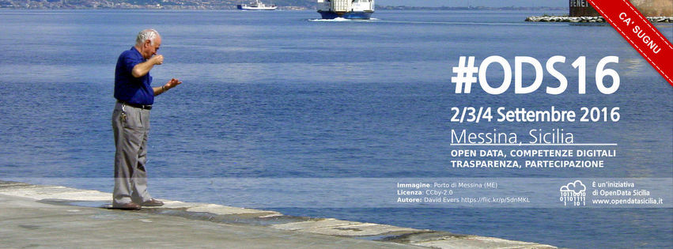
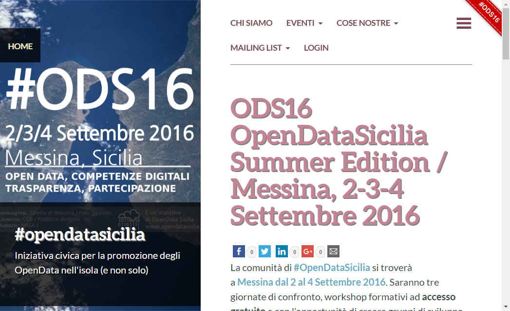

# C'è #ODS16, dillo a tutti

Brevi note sul come fare arrivare nel globo terraqueo notizie sul [**raduno 2016**](http://ods16.opendatasicilia.it/) di **OpenDataSicilia**.

## Anagrafica di base

- il **sito web** del raduno è [http://ods16.opendatasicilia.it/](http://ods16.opendatasicilia.it/);
- l'hashtag è **#ODS16**: usatelo per favore tutte le volte che parlate del raduno di Messina;
- per fare **donazioni** e **supportare** l'organizzazione del raduno usare il form a questo indirizo [http://bit.ly/ods16support](http://bit.ly/ods16support).

## Cover facebook

Tutti quelli che saranno presenti, e lo volessero fare sapere in giro, potrebbero usare per un po' di tempo [questa immagine](https://raw.githubusercontent.com/SiciliaHub/ods16/gh-pages/comunicazione/condivisione_sui_social/ODS16_facebook_cover_withRibbon.jpg) come *cover* del loro profilo **facebook**.

 

Nel ribbon in alto a destra c'è scritto "CA' SUGNU", ovvero "qua sono" in siciliano. A partire da [questo file](https://github.com/SiciliaHub/ods16/raw/gh-pages/comunicazione/condivisione_sui_social/ODS16_facebook_cover_withRibbon.zip) vettoriale in formato SVG, potrete **personalizzare** la frase nel modo che preferite.

[Giuseppe](https://twitter.com/giuragu) ad esempio l'ha personalizzata con "[amunì](https://raw.githubusercontent.com/SiciliaHub/ods16/gh-pages/comunicazione/condivisione_sui_social/esempi/giuragu.png)".

## Ribbon

Se inserirete il codice seguente nella vostra **pagina web**, in alto a destra apparità il **ribbon rosso** che vedete nell'immagine poco sotto. Al click su questo si aprirà la pagina del raduno.

E' un altro modo con cui potrete aiutarci a **fare passaparola**.


```html
<a href="http://bit.ly/ods16ribbon">

</a>
```

 

## Nel modo che vi diverte di più

Quelli di sopra sono soltanto suggerimenti, ma scatenate il vostro estro liberamente. Giulio ad esempio è stato [titanico](https://twitter.com/giuliodichiara/status/753598697749946368)!

[Qui](https://github.com/SiciliaHub/ods16/tree/gh-pages/comunicazione) trovate vari file da usare, modificare o da cui prendere spunto.

## Credits

A [Nelson](https://twitter.com/nelsonmau) si deve la creazione di tutte le immagini "ufficiali" create per #ODS16.

